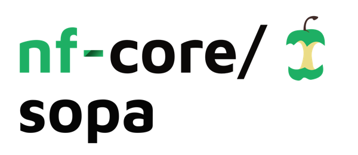

<h1>
  <picture>
    <source media="(prefers-color-scheme: dark)" srcset="docs/images/nf-core-sopa_logo_dark.png">
    
  </picture>
</h1>

[](https://github.com/nf-core/sopa/actions/workflows/nf-test.yml)
[](https://github.com/nf-core/sopa/actions/workflows/linting.yml)[](https://nf-co.re/sopa/results)[](https://doi.org/10.5281/zenodo.XXXXXXX)
[](https://www.nf-test.com)

[](https://www.nextflow.io/)
[](https://github.com/nf-core/tools/releases/tag/3.3.2)
[](https://docs.conda.io/en/latest/)
[](https://www.docker.com/)
[](https://sylabs.io/docs/)
[](https://cloud.seqera.io/launch?pipeline=https://github.com/nf-core/sopa)

[](https://nfcore.slack.com/channels/sopa)[](https://bsky.app/profile/nf-co.re)[](https://mstdn.science/@nf_core)[](https://www.youtube.com/c/nf-core)

## Introduction

**nf-core/sopa** is the Nextflow version of [Sopa](https://github.com/gustaveroussy/sopa). Built on top of [SpatialData](https://github.com/scverse/spatialdata), Sopa enables processing and analyses of spatial omics data with single-cell resolution (spatial transcriptomics or multiplex imaging data) using a standard data structure and output. We currently support the following technologies: Xenium, Visium HD, MERSCOPE, CosMX, PhenoCycler, MACSima, Molecural Cartography, and others. It outputs a `.zarr` directory containing a processed [SpatialData](https://github.com/scverse/spatialdata) object, and a `.explorer` directory for visualization.

<p align="center">
  
</p>

0. (Visium HD only) Raw data processing with Space Ranger
1. (Optional) Tissue segmentation
2. Cell segmentation with Cellpose, Baysor, Proseg, Comseg, Stardist, ...
3. Aggregation, i.e. counting the transcripts inside the cells and/or averaging the channel intensities inside cells
4. (Optional) Cell-type annotation **_- coming soon_**
5. User-friendly output creation for visualization and quick analysis
6. Full [SpatialData](https://github.com/scverse/spatialdata) object export as a `.zarr` directory

After running `nf-core/sopa`, you can continue analyzing your `SpatialData` object with [`sopa` as a Python package](https://gustaveroussy.github.io/sopa/).

## Usage

> [!NOTE]
> If you are new to Nextflow and nf-core, please refer to [this page](https://nf-co.re/docs/usage/installation) on how to set-up Nextflow. Make sure to [test your setup](https://nf-co.re/docs/usage/introduction#how-to-run-a-pipeline) with `-profile test` before running the workflow on actual data.

First, prepare a samplesheet that lists the `data_path` to each sample data directory (typically, the per-sample output of the Xenium/MERSCOPE/etc, see more info [here](https://gustaveroussy.github.io/sopa/faq/#what-are-the-inputs-or-sopa)). You can optionally add `sample` to provide a name to your output directory, else it will be named based on `data_path`. Here is a samplesheet example:

`samplesheet.csv`:

```csv
sample,data_path
SAMPLE1,/path/to/one/merscope_directory
SAMPLE2,/path/to/one/merscope_directory
```

> [!WARNING]
> If you have Visium HD data, the samplesheet will have a different format than the one above. Directly refer to the [usage documentation](https://nf-co.re/sopa/usage) and the [parameter documentation](https://nf-co.re/sopa/parameters).

Then, choose the Sopa parameters. You can find existing Sopa params files [here](https://github.com/gustaveroussy/sopa/tree/main/workflow/config), and follow the [corresponding README instructions](https://github.com/gustaveroussy/sopa/blob/main/workflow/config/README.md) of to get your `-params-file` argument.

Now, you can run the pipeline using:

```bash
nextflow run nf-core/sopa \
   -profile <docker/singularity/.../institute> \
   --input samplesheet.csv \
   -params-file <PARAMS_FILE> \
   --outdir <OUTDIR>
```

> [!WARNING]
> Please provide pipeline parameters via the CLI or Nextflow `-params-file` option. Custom config files including those provided by the `-c` Nextflow option can be used to provide any configuration _**except for parameters**_; see [docs](https://nf-co.re/docs/usage/getting_started/configuration#custom-configuration-files).

For more details and further functionality, please refer to the [usage documentation](https://nf-co.re/sopa/usage) and the [parameter documentation](https://nf-co.re/sopa/parameters).

## Pipeline output

To see the results of an example test run with a full size dataset refer to the [results](https://nf-co.re/sopa/results) tab on the nf-core website pipeline page.
For more details about the output files and reports, please refer to the
[output documentation](https://nf-co.re/sopa/output).

## Credits

nf-core/sopa was originally written by Quentin Blampey during his work at the following institutions: CentraleSupélec, Gustave Roussy Institute, and Université Paris-Saclay.

We thank the following people for their extensive assistance in the development of this pipeline:

<!-- TODO nf-core: If applicable, make list of people who have also contributed -->

## Contributions and Support

If you would like to contribute to this pipeline, please see the [contributing guidelines](.github/CONTRIBUTING.md).

For further information or help, don't hesitate to get in touch on the [Slack `#sopa` channel](https://nfcore.slack.com/channels/sopa) (you can join with [this invite](https://nf-co.re/join/slack)).

## Citations

<!-- TODO nf-core: Add citation for pipeline after first release. Uncomment lines below and update Zenodo doi and badge at the top of this file. -->
<!-- If you use nf-core/sopa for your analysis, please cite it using the following doi: [10.5281/zenodo.XXXXXX](https://doi.org/10.5281/zenodo.XXXXXX) -->

An extensive list of references for the tools used by the pipeline can be found in the [`CITATIONS.md`](CITATIONS.md) file.

You can cite the `sopa` publication as follows:

> Sopa: a technology-invariant pipeline for analyses of image-based spatial omics.
>
> Quentin Blampey, Kevin Mulder, Margaux Gardet, Stergios Christodoulidis, Charles-Antoine Dutertre, Fabrice André, Florent Ginhoux & Paul-Henry Cournède.
>
> _Nat Commun._ 2024 June 11. doi: [10.1038/s41467-024-48981-z](https://doi.org/10.1038/s41467-024-48981-z)

You can cite the `nf-core` publication as follows:

> **The nf-core framework for community-curated bioinformatics pipelines.**
>
> Philip Ewels, Alexander Peltzer, Sven Fillinger, Harshil Patel, Johannes Alneberg, Andreas Wilm, Maxime Ulysse Garcia, Paolo Di Tommaso & Sven Nahnsen.
>
> _Nat Biotechnol._ 2020 Feb 13. doi: [10.1038/s41587-020-0439-x](https://dx.doi.org/10.1038/s41587-020-0439-x).
